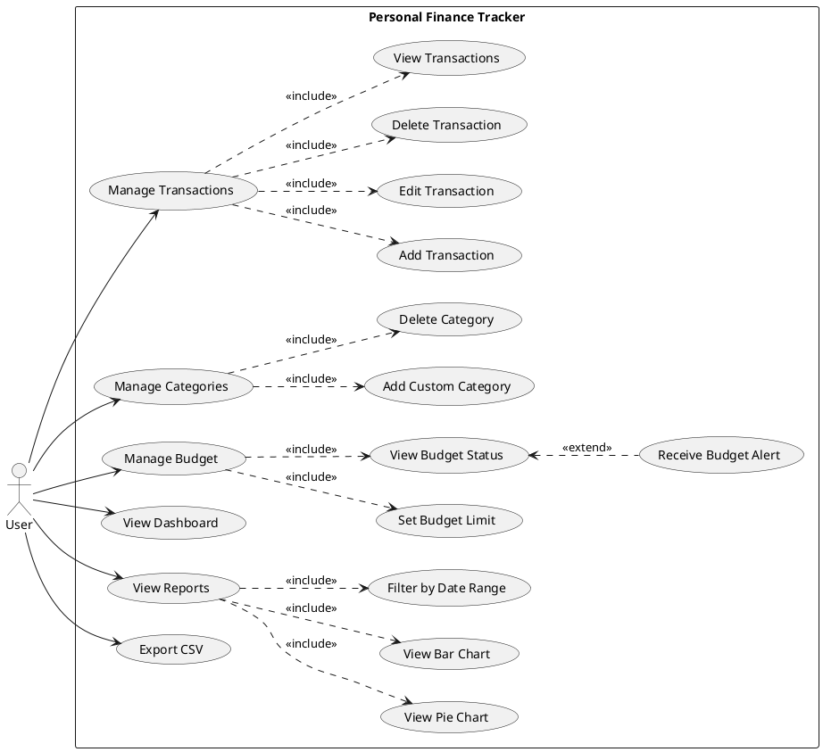
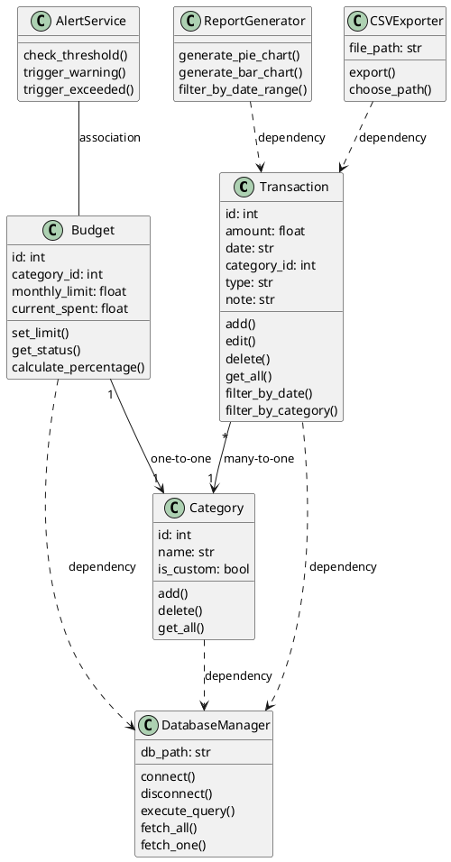
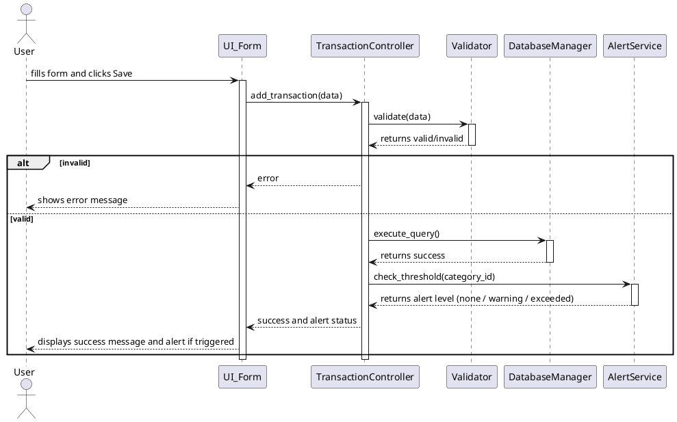
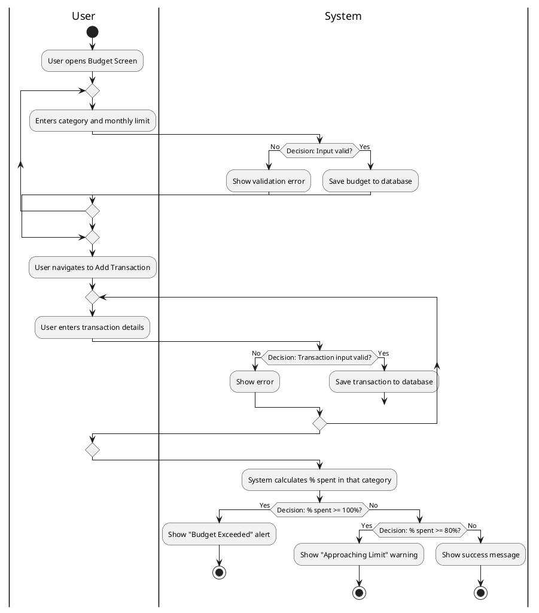
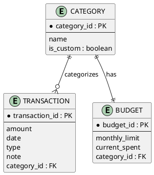

# Draw.io Import Codes (PlantUML)

You can generate these diagrams directly in Draw.io! 
To do this in Draw.io, go to **Arrange > Insert > Advanced > PlantUML...** and paste the code for the respective diagram.

## 1. Use Case Diagram

## 2. Class Diagram

## 3. Sequence Diagram (Add New Transaction)

## 4. Activity Diagram (Budget Setting and Alert Flow)

## 5. Entity Relationship Diagram (ERD)

