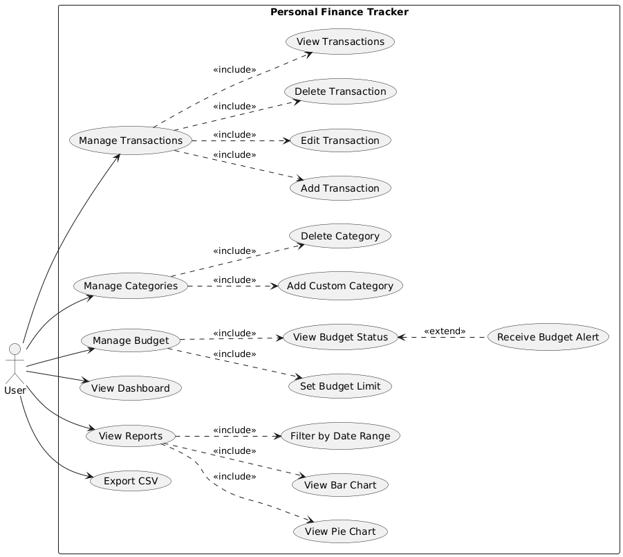
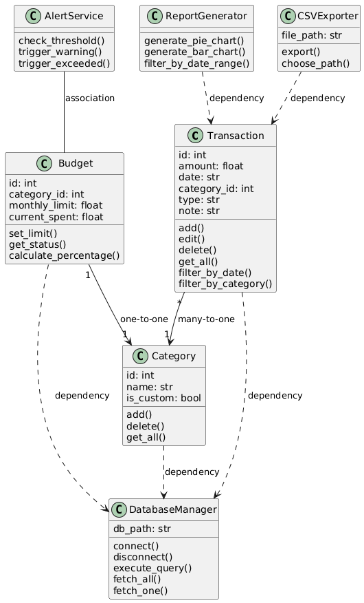
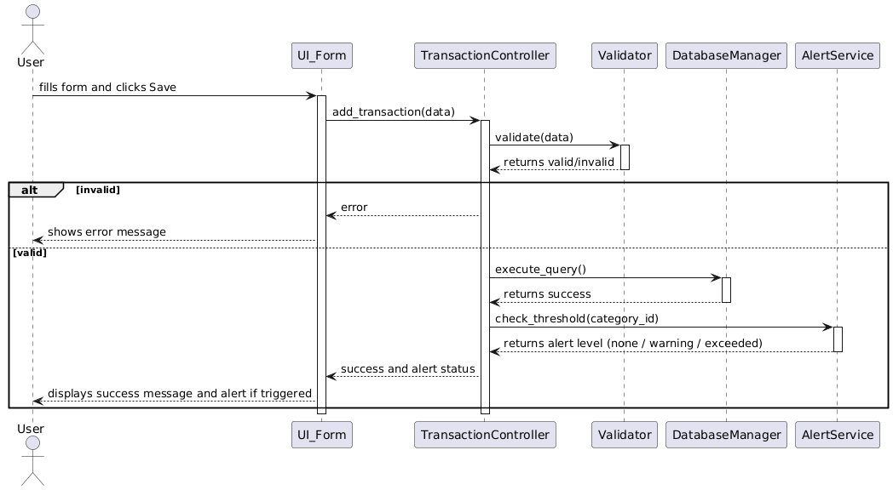
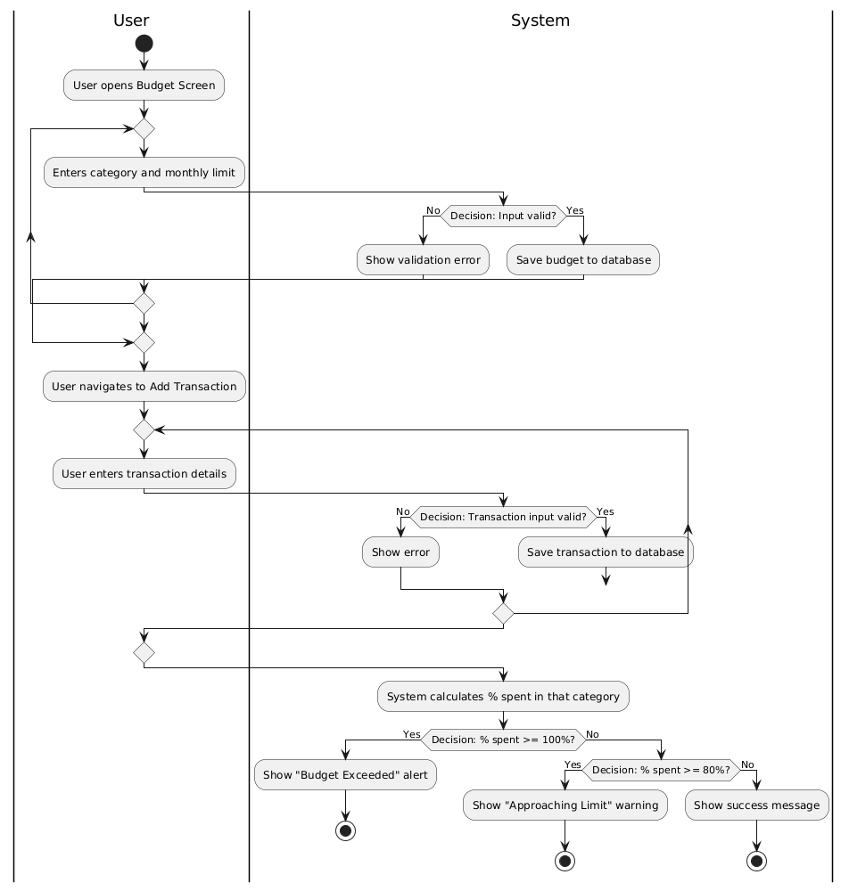
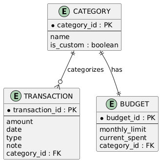

# System Architecture Diagrams

This document contains the core structural and behavioral diagrams for the Personal Finance Tracker application.

## 1. Use Case Diagram

## 2. Class Diagram

## 3. Sequence Diagram (Add New Transaction)

## 4. Activity Diagram (Budget Setting and Alert Flow)

## 5. Entity Relationship Diagram (ERD)

